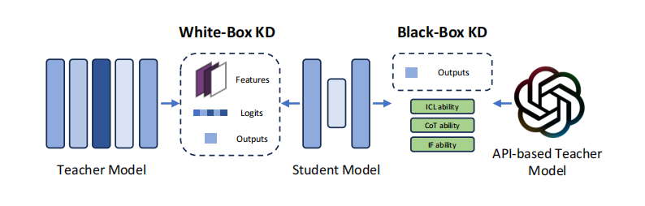
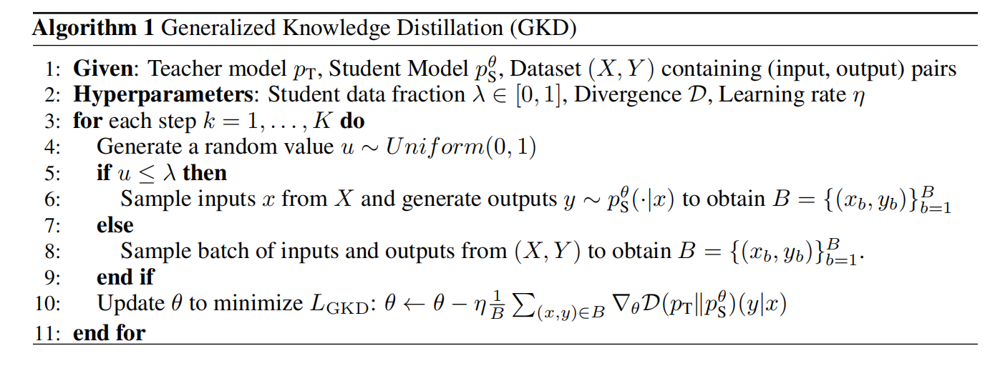
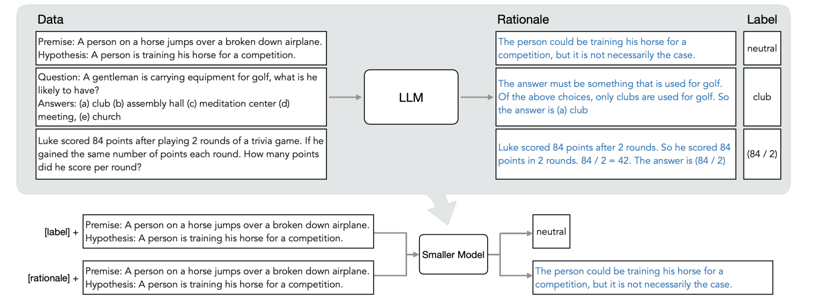
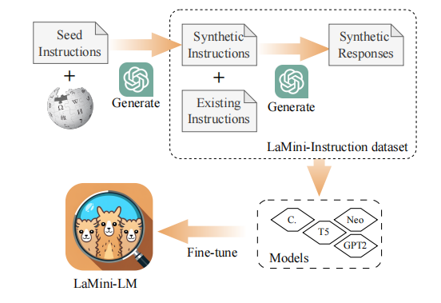

## 知识蒸馏
将大模型（教师模型）的能力转移到小模型（学生模型）上面。利用大模型的输出来训练小模型，让模型的输出和大模型对齐。

一般分为White-Box蒸馏和Black-Box蒸馏。White-Box蒸馏是指知道教师模型的参数和结构，能够充分利用教师模型的数据，包括输出的句子，中间层的状态等；Black-Box蒸馏指教师模型不可以获得，只能通过api获取教师模型的输出（例如Chat-GPT），形成prompt-response的数据对，训练学生模型的推理能力，包括CoT(Chain-of-Thought，能够将大问题拆分为小问题，一步步推理)，IF(Instruction Following，能够理解和执行用户给出的指令)，ICL(In-Context Learning，能够自动适应当前的新任务而不需要专门训练)。


cited from [Survey](https://arxiv.org/abs/2404.14294)

### KL散度

在White-Box蒸馏中，一般使用KL散度来衡量教师模型输出的分布和学生模型输出的分布直接的差距，即
$$
D_{KL}(P||Q) = \sum_{x\in X} P(x)\log \frac{P(x)}{Q(x)} = \sum_{x\in X} P(x)(\log P(x)-\log Q(x))
$$
这里$P(x)$一般就是教师模型的输出分布，而$Q(x)$是学生模型的输出分布。

在实际的模型中，设$y_t\in R^{B\times N}$表示教师模型的输出，$y_s \in R^{B\times N}$表示学生模型输出，$B$表示batch size，而$N$表示特征维度。这里$y_t, y_s$都是模型的输出，没有经过$softmax$，那么
$$
\mathcal{L}_{kd}(y_t, y_s) = \frac{\tau^2}{B}\sum_i D_{KL}(softmax(y^i_t/\tau)||softmax(y^i_s/\tau))
$$
这里的$\tau$用于平滑教师模型的输出，防止其输出经过softmax后和one-hot编码过于相近。
在pytorch中，使用如下代码计算
```python
from torch.nn.functional as F
beta_logits_T = logits_T / temperature
beta_logits_S = logits_S / temperature
p_T = F.softmax(beta_logits_T, dim=-1)
loss = temperature*temperature*F.kl_div(F.log_softmax(beta_logits_S, dim=-1), p_T, reduction='batchmean') ##这里学生的分布需要输入之前就log，而教师的分布在函数里面做log，batchmean 就是上面的1/B

# https://pytorch.org/docs/stable/generated/torch.nn.KLDivLoss.html
```


一般会使用KL的损失和CE(ross entropy)损失的加权和作为实际的训练损失，即
$$
\mathcal{L} = \alpha \mathcal{L}_{ce}(y_{true}, y_s) + \beta \mathcal{L}_{kd}(y_t, y_s)
$$ 
这里的$y_{true}$表示真实的标签。

参考：https://ramesharvind.github.io/posts/deep-learning/knowledge-distillation/


### 论文总结
大模型这边的蒸馏主要还是关注数据的生成和训练流程。

|method|type|
|---|---|
|MiniLLM|White-Box|
|GKD|White-Box|
|Distilling Step-by-Step|Black-Box (CoT)|
|Multitask-ICT|Black-Box (ICL)|
|LaMini-LM|Black-Box (IF)|

## MiniLLM
[MiniLLM: Knowledge Distillation of Large Language Models](https://arxiv.org/abs/2306.08543)


将训练的目标从KL变成 Reverse KL，即
$$
D_{KL}(P||Q) => D_{KL}(Q||P)
$$


## GKD
[On-Policy Distillation of Language Models: Learning from Self-Generated Mistakes](https://arxiv.org/abs/2306.13649)

直接使用KD在一个数据集上面训练，容易导致学生模型的输出在其他数据上效果很差。这里使用学生模型生成一部分的数据，然后同时在学生模型生成的数据和原本的数据上进行训练。



## Distilling Step-by-Step
[Distilling Step-by-Step! Outperforming Larger Language Models with Less Training Data and Smaller Model Sizes](https://arxiv.org/abs/2305.02301)

**利用CoT**，让教师大模型对输入的问题不仅输出结果，并输出相应的理由。然后同时使用生成的结果和理由来训练小模型，这样小模型在学习理由时能够学到更多的知识，而不是仅仅利用输入和答案的配对来训练小模型。




## Multitask-ICT
[In-context Learning Distillation: Transferring Few-shot Learning Ability of Pre-trained Language Models](https://arxiv.org/abs/2212.10670)

## LaMini-LM
[LaMini-LM: A Diverse Herd of Distilled Models from Large-Scale Instructions](https://arxiv.org/abs/2304.14402)

指导GPT生成了一个大小为2.58M的多样性指令数据集，然后使用该数据集训练了一系列的小模型。

