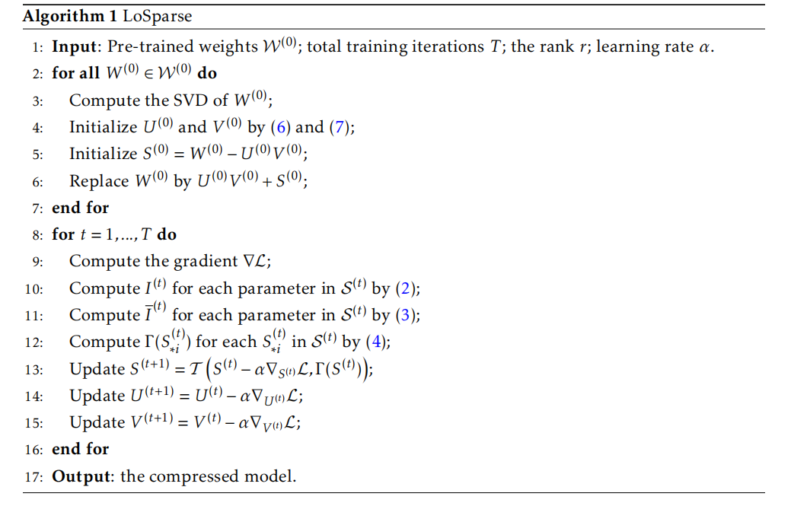

## 低秩分解
将一个大矩阵进行奇异值分解成两个小矩阵，保留主要的秩，就可以节约内存。

对于矩阵$A^{m\times n}$，进行SVD分解，得到
$$
A^{m\times n} = U^{m\times m} \Sigma ^{m\times n} (V^T)^{n\times n}
$$
其中 **$U$和$V$都是正交矩阵，分别是$AA^T$和$A^TA$的特征列向量组成的矩阵，$ \Sigma $是对角矩阵，称为奇异值，其每个元素是$AA^T$的非零特征值（$A^TA$的非零特征值相同）的平方根，且按从大到小的顺序排列**。

因此，前面的奇异值大的部分包含了大部分矩阵的信息，可以只保留这部分信息，从而减小矩阵大小。例如只保留前k个奇异值，则有
$$
A^{m\times n} \approx U^{m\times k} \Sigma ^{k\times k} (V^T)^{k\times n} = (U^{m\times k} \Sigma ^{k\times k})(V^T)^{k\times n} = X^{m\times k} Y^{k\times n}
$$

那么原矩阵就压缩为两个小的矩阵，即压缩率为
$$
1-\frac{mk+kn}{mn}
$$

由于模型输出值不仅和权重相关，也和激活值有关，所以直接分解权重最后的误差较大，需要考虑激活值来优化误差，即
$$
W^* = \argmin_{W'}||W'X-WX||
$$

**基本方法都是让$W$乘上一个可逆的矩阵$S$，然后分解$WS$，分解完后在乘上$S^{-1}$，即**
$$
W = WSS^{-1} = svd(WS)S^{-1} = U\Sigma V^TS^{-1} \approx U_k\Sigma_k V^T_kS^{-1}
$$
**主要是$S$的选择，需要和$X$挂钩，例如$W$的二阶梯度（根据$X$计算），$X$的模，$XX^T$的分解等。**

### 求解SVD

对于矩阵$B^{n\times n}$，求其所有的特征值$\lambda_i$和特征向量$v_i$，即
$$
Bv_i = \lambda_iv_i => B (v_1, v_2, ... , v_n) =   (\lambda_1v_1, \lambda_2v_2, ... , \lambda_nv_n) => B = W\Sigma W^{-1} =  W\Sigma W^{T} \\
W = (v_1, v_2, ... , v_n) , \Sigma = \text{diag}(\lambda_1, \lambda_2, ..., \lambda_n)
$$
其中$v_i$为标准向量化，所以$W$是正交阵（**列向量为单位向量，并且两两正交，即$W^TW = I$**）。

那么，对于$AA^T$，有
$$
AA^T = U\Sigma V^T V\Sigma ^T U^T = U \Sigma \Sigma ^T U^T
$$
$ \Sigma \Sigma ^T $ 还是对角矩阵，因此$U$就可以是$AA^T$特征列向量的集合，$ \Sigma \Sigma ^T $是特征值形成的对角矩阵。

同理，可以通过$A^TA$，求
$$
A^TA = V\Sigma ^T U^T U\Sigma V^T  = V \Sigma \Sigma ^T V^T
$$
$ \Sigma \Sigma ^T $ 还是对角矩阵，因此$V$就可以是$A^TA$特征列向量的集合，$ \Sigma \Sigma ^T $是特征值形成的对角矩阵。

因此，只要求解了$A^TA$和$AA^T$的特征值和特征向量，就能够得到$U$, $V$, $\Sigma$，其中$\Sigma$就是$A^TA$的特征值的平方根。

$A^TA$是半正定矩阵，即其所有的特征值都大于等于0（正定矩阵都是大于0）。$A^TA$的秩和$A$的秩相同。$AA^T$同理。且$A^TA$和$AA^T$有相同的非零特征值，但是对应的特征值相同不同。

$$
AA^Tv = \lambda v=>  A^TAA^Tv =  \lambda A^Tv => A^TA(A^Tv) =  \lambda (A^Tv)\\
A^TAu = \lambda u, u = A^Tv
$$

## TensorGPT
[TensorGPT: Efficient Compression of Large Language Models based on Tensor-Train Decomposition](https://arxiv.org/abs/2307.00526)

## LoSparse
[LoSparse: Structured Compression of Large Language Models based on Low-Rank and Sparse Approximation](https://arxiv.org/abs/2306.11222)

基本思想是结合剪枝和低秩分解，使用剪枝的稀疏化矩阵来补偿低秩分解的影响。
$$
W = UV + S
$$
$U,V$是低秩分解矩阵，$S$是剪枝的稀疏矩阵。该方法中需要使用数据集，对$U,V, S$进行迭代更新。
$$
svd(W) = (U\sqrt{\Sigma})(\sqrt{\Sigma}V^T) = U_0V_0 \\
S_0 = W-U_0V_0
$$
然后这里$S_0$还不是稀疏矩阵，需要进行迭代裁剪，并同步更新$U_0V_0$。

## FWSVD
[Language model compression with weighted low-rank factorization](https://arxiv.org/abs/2207.00112)

基本思想就是给权重$W$乘上一个矩阵$S$进行再分解。这里的出发点是衡量$W$中每个权重的重要性不同，梯度大的重要性应该更大。因此，这里使用Fisher信息矩阵（其实就是二阶导数矩阵）来衡量权重的重要性，即将Fisher矩阵$I$乘以$W$，再分解，最后再乘以$I^{-1}$。

为了方便计算，这里使用一阶导数的外积对信息矩阵进行估计，即
$$
I \approx \mathbb{E}(\frac{\partial \log f(x,w)}{w} \otimes (\frac{\partial \log f(x,w)}{w})^T)
$$
这里$I$应该是一个$s\times s$的矩阵，$s$是参数的数量（即整个矩阵的大小，$s=m\times n$）。$\frac{\partial \log f(x,w)}{w}$是对每个$w_{ij}$求一阶导数形成的$s$维向量。 $f(x,w)$是损失函数。

针对每个元素$w_{ij}$，其实只需要$I$对应的对角线上的元素，就是一阶导数的平方。因此，对应一个权重$w_{ij}$，其对应信息量为
$$
I_{w_{ij}} = \frac{1}{|D|}\sum_{i=1}^{|D|}(\frac{\partial \log f(x_i,w_{ij})}{w_{ij}})^2
$$
其中$D$表示数据集。因此，应该为每个权重乘上一个$I_{w_{ij}}$来优化分解损失。即，假设将$W$分解为$AB$两个矩阵，那么求解$A$和$B$中的每个元素，应该满足
$$
\min_{A,B} \sum_{i,j} I_{W_{ij}}(W_{ij}-(AB)_{ij})
$$
该公式是无法直接求解的。因此，让$W$的一行的所有元素都有相同的权重，为这一行的所有元素的权重的和（**也许可以尝试其他组合方式，乘，平均，最大值等**），即
$$
I_{w_i} = \sum_j I_{w_{ij}}
$$
然后定义对角矩阵（**为什么是平方根**）
$$
\hat{I} = diag(\sqrt{I_{w_1}}, \sqrt{I_{w_2}}, ..., \sqrt{I_{w_m}})
$$
因此，分解$IW$，即
$$
W = I^{-1}IW \approx I^{-1}svd_k(IW) = I^{-1}U_k\Sigma_k V_k^T = (I^{-1}U_k\Sigma_k)V_k^T = AB
$$

## ASVD
[ASVD: Activation-aware Singular Value Decomposition for Compressing Large Language Models](https://arxiv.org/abs/2312.05821)

### 关键方法
由于激活值中存在离群值，所以直接分解权重没有考虑到激活值$X$，误差较大。因此，该工作利用一个可逆的$S$矩阵来变换需要分解的权重矩阵，即
$$
W = WSS^{-1} = (WS)S^{-1} = W^tS^{-1} \\
W^t = U\Sigma V^T => W^t \approx U_{k}\Sigma_k V^T_k\\
W = W^tS^{-1} \approx U_{k}\Sigma_k V^T_kS^{-1} = (U_{k}\sqrt{\Sigma_k})(\sqrt{\Sigma_k}V^T_kS^{-1}) = XY
$$

需要找到一个好的$S$来变换权重。文中将$S$处理成对角阵，然后通过激活$X$来确定对角元素的值。其使用$X$每个通道的绝对值的平均值作为$S$的值，即
$$
WX = (WS)(S^{-1})X\\
S_{ii} = (\frac{1}{n}\sum_{j=1}^n|X_{ij}|)^\alpha
$$
这样的设置其实就是将$X$离群值（绝对值大）的影响考虑进矩阵的分解中，使得离群值所对应的权重有更大的影响。

**这种设置本质上就是[AWQ](https://arxiv.org/pdf/2306.00978)这个论文中所关注的点，只是从量化迁移到了SVD分解。**

### 其他优化
1. 对不同的层和不同的权重矩阵测试其对压缩率的敏感度，然后设置合适的压缩率。测试的方法就是压缩到不同的比率，然后计算PPL。
2. KV-Cache的压缩存储。由于kv的权重矩阵被分解了，即$XW_k = XA_kB_K$，所以只需要存储$XA_k$，然后需要时再计算$XA_kB_k$。 

## SVD-LLM
[SVD-LLM: Truncation-aware Singular Value Decomposition for Large Language Model Compression](https://arxiv.org/abs/2403.07378)

在ASVD的基础上，优化了$S$矩阵的构建，将移除奇异值造成的损失直接量化出来，这样就可以保证移除造成影响最小的奇异值。而ASVD虽然移除了最小的奇异值，但是实际上可能对输出的结果的影响并不是最小的。 

假设移除第$i$个奇异值，就有损失$L_i$
$$
L_i = ||(WS-(WS)')S^{-1}X||_F = ||(U\Sigma V^T-U\Sigma' V^T)S^{-1}X||_F \\= ||(U(\Sigma -\Sigma') V^T)S^{-1}X||_F = ||\sigma_i u_iv_i^TS^{-1}X||_F \\
=\sigma_i trace(u_iv_i^TS^{-1}XX^T(S^{-1})^Tv_iu_i^T)^{\frac{1}{2}} \\
U = (u_1, u_2, ..., u_m), V = (v_1, v_2, ..., v_n), \Sigma = diag(\sigma_1, \sigma_2, ..., \sigma_r)\\
||A||_F =(\sum_i\sum_j|a_{ij}|^2)^{\frac{1}{2}} = trace(AA^T)^\frac{1}{2}
$$
**让$S$ 为$XX^T$ 的Cholesky（科列斯基）分解**，即
$$
XX^T = SS^T
$$
Cholesky分解的要求是矩阵为对称（$A^T=A$）正定阵（特征值大于0），结果$S$是一个下三角矩阵。$XX^T$是对称的半正定矩阵。由于$X$基本上是满秩的，所以$XX^T$基本上是正定的。

因此，有
$$
L_i = \sigma_i trace(u_iv_i^TS^{-1}XX^T(S^{-1})^Tv_iu_i^T)^{\frac{1}{2}}  = \sigma_i trace(u_iv_i^TS^{-1}SS^T(S^{-1})^Tv_iu_i^T)^{\frac{1}{2}} = \sigma_i
$$
因此，在$S$为为$XX^T$ 的Cholesky分解的前提下，移除一个奇异值的误差就是其本身，所以移除最小的奇异值造成的误差最小。这里直接将移除奇异值和其造成的影响量化，形成对应关系，能够在理论上保证最小的影响。

当移除最小的几个奇异值时，即$\sigma_k, \sigma_{k+1}, ..., \sigma_r$，造成的误差为
$$
L^2 = ||\sum_{i=k}^r \sigma_iu_iv_i^TS^{-1}X||_F^2 = \sum_{i=k}^r\sigma_i^2trace(u_iv_i^TS^{-1}XX^T(S^{-1})^Tv_iu_i^T) = \sum_{i=k}^r\sigma_i^2
$$
其中，当$i!=j$时，$u_iu_j$和$v_iv_j$全部为0，所以所有的交叉项都为0。

综上，使用Cholesky构造的$S$能够很好地建模分解过程，使得分解的误差被量化，能够选择最小的奇异值进行移除。

**当然，这里并不是说使用Cholesky构造的$S$最好，只是说这样构造能够为移除奇异值的选择提高理论保证。**

